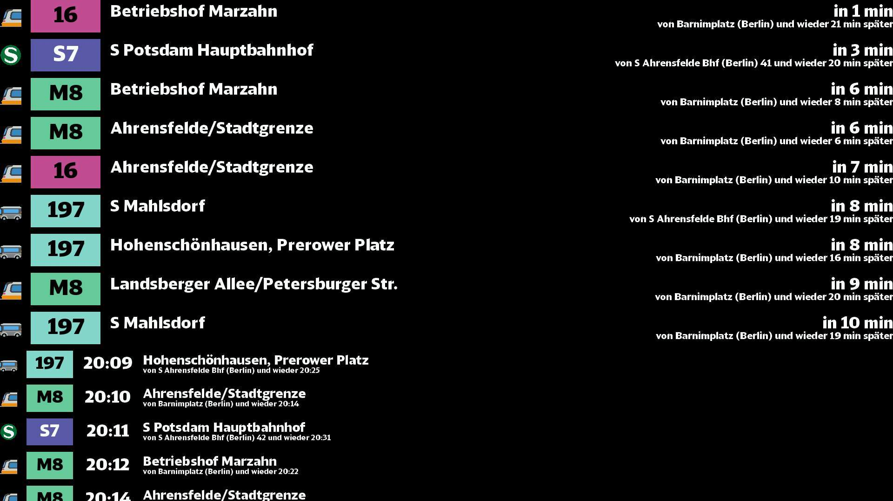

# RMV Abfahrtsplan

This package allows you to display a HAFAS powered departure board.

## Caching

If you're running a lot of info-beamer instances, you might run into
issues where you don't get enough updates without getting over the api
request limit. To circumvent this, you can use the included
`cache_runner.py` script.

The script will read a standard `config.json`, with the additional
undocumented option of setting a specific `outdir` to put the json
files somewhere else.

In info-beamer just input the path to the cached json files. Authentication
is not supported as of now.
